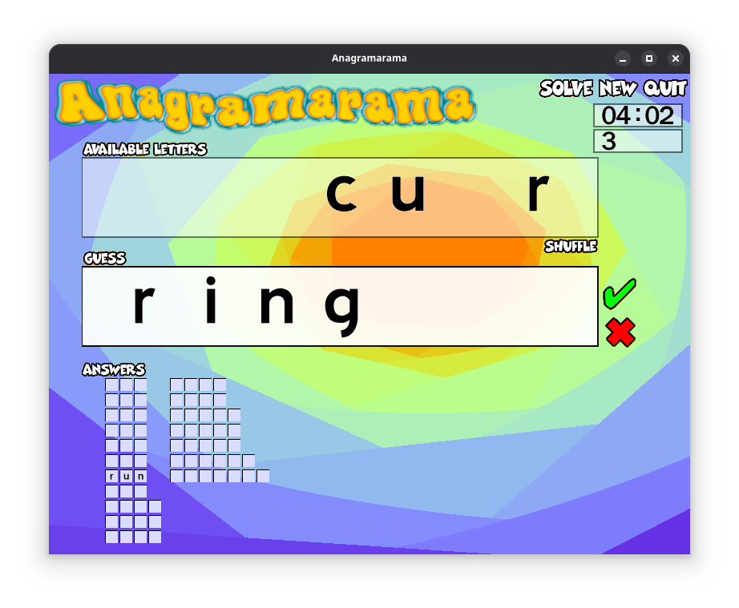

# Anagramarama in C-Sharp and OOP

## What is this

The anagram game Anagramarama.  
Works with Windows, MacOS (only intel CPU tested so far), linux  



The original Anagramarama (v0.7/0.8), but rewritten in C# (.net8.0+) and object oriented  
Released under GPL2 as the original authors of the application in C did  

## How to play?

- Download the [release](https://github.com/Squizzy/anagramarama-cs-oop/releases/tag/v1.0.0) version from this github for the desired OS  
- Unzip the downloaded file
- Launch the executable ('anagramarama' for linux/macOS, 'anagramarama.exe' for windows)

> NOTE: There is no installer yet, and the MacOS version is not yet available as a package...  
> This is on the TODO list, but the executables already run fine (normally)  

### Keyboard usage

| Key | Effect |
| ---: | --- |
| LETTER A to Z | Move Available Letter to the Guess |
| BACKSPACE | Remove the rightmost letter from the Guess  |
| ESCAPE: | Remove all the letters from the Guess  |
| SPACE | Rhuffle the letters in the Available Letters  |
| F1 | Switch between full screen or windowed  |
| F2 | Start a new game  |
| F5| Quit the game|

> NOTE: F5 not available in release v1.0.0  |

### Command line

It is possible to run the application from a terminal window for added information or to select a different language, by using command line switches.

> e.g.: anagramarama.exe -h

Command line switches:  

| Switch | Effect |
| - | - |
| -h/--help | help (eg shortcut keys)  |
| -v/--version | version number|
| -l/--locale \<locale-code\> | specify the language (locale-code such as "en-GB" or "fr-FR")|

> NOTE: If the language is not a language registered in the application, the application will attempt to check if the language wordslist is present is in the 'i18n/locale-code' folder. If not, it will default to back to UK English (gb-GB) |

##

## How to compile and run

> The application is open source so instead of downloading the executable, the source files can be downloaded, verified (if so enclined) and compiled.

### Code editor

- [VSCode](https://code.visualstudio.com/download)

### Development platform: C# + Dotnet

- [DotNet 8.0 or above](https://dotnet.microsoft.com/en-us/download)
- and the relevant extensions for vscode if desired

### Logging

- Using Serilog
<!-- ### Logging (two options)

 1. Microsoft: MS Extension logging, MS output to Console (terminal), MS output to vscode Debug Console  
  ```
    dotnet add package Microsoft.Extensions.Logging  
    dotnet add package Microsoft.Extensions.Logging.Consoled
    dotnet add package Microsoft.Extensions.Logging.Debug
  ```

2. Serilog: Serilog logging, Serilog output to Console, Serilog output to file, Serilog output to vscode Debug Console, Serilog Console themes:  -->

<!-- ``` -->
```shell
dotnet add package Serilog.Extensions.Logging  
dotnet add package Serilog.Sinks.Console  
dotnet add package Serilog.Sinks.File  
dotnet add package Serilog.Sinks.Debug  
dotnet add package Serilog.Sinks.SystemConsole.Themes
```

### SDL2 development librairies

- Jeremy Sayers' [SDL2 adaptation for C#](https://jsayers.dev/tutorials/)  
- This application was developed using only this set of librairies, and not tested with any others SDL2 bindings  

### Clone this repository

In a terminal window run:

```shell
git clone https://github.com/Squizzy/anagramarama-cs-oop.git
  ```

### Note on final installation

- The "i18n" and the "audio" folders needs to be copied into the correct folder for the OS (to be improved!)  
- Jim Rich listed the [path variable for multiple OS here](https://jimrich.sk/environment-specialfolder-on-windows-linux-and-os-x/)  
- The variable needed is under the name: ```Environment.SpecialFolder.LocalApplicationData```  
      eg in windows: ```C:\Users\\<username\>\AppData\Roaming\anagramarama\```

### Running from the source code

> From inside the folder AgOop, execute:  
>
> ```shell
> dotnet run
> ```

### Creating the executables from the source code

The operation is similar for Windows, MacOs or Linux use:  

#### If ok to modify AgOop.csproj content

  In AgOop.csproj, Uncomment the RuntimeIdentifier for the desired OS by removing the ```<!-- -->```

  > e.g. to compile for windows x64:
  >
  > ```csproj
  > <RuntimeIdentifier>win-x64</RuntimeIdentifier>
  > <!-- <RuntimeIdentifier>linux-x64</RuntimeIdentifier> -->
  > <!-- <RuntimeIdentifier>osx-x64</RuntimeIdentifier> -->
  > ```

#### Create the executable using either

  i. Alternative 1: From the terminal

  ```shell
  dotnet publish -c release
  ```

  ii. Alternative 2: Using ```Solution Explorer``` vscode extension:  

  e.g.: [fernandoescolar's vscode-solution-explorer](vscode:extension/fernandoescolar.vscode-solution-explorer)  

  > ```AppUse
  > Right click the AgOop solution in the solutin explorer extension. this brings up a menu    
  > Select "publish"
  > ```

### If modifying AgOop.csproj is not considered

from the command line:
> Windows:  
>
> ```shell
> dotnet publish --runtime win-x64
> ```
>
> MacOs (intel version):  
>
> ```shell
> dotnet publish --runtime osx-x64
> ```
>
> Linux:  
>
> ```shell
> dotnet publish --runtime linux-x64
> ```

## History

25 Jun 2025: Release v1.0.0

## Credit

All who developed the original application (Colm Gallagher, Denis Payne, Alan Grier, Thomas Plunkett, Michele Brucelli, Pat Thoyts) as well as those who identified and fixed bugs and issues.
Latest version maintained by Dulsi: [Github repository](https://identicalsoftware.com/anagramarama/)

Some interesting mods in this fork (generally not implemented in this version): [Lexijeux](http://patrick.jenty.free.fr/_libre/anagramarama.php)
